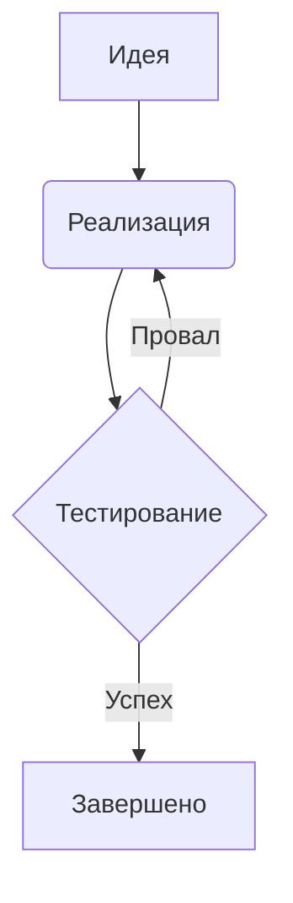

# 03. Графика и визуализация в Obsidian

## Лучшие практики работы с визуальными элементами

1. **Вставка изображений**
   - Используйте относительные пути: `![[image.png]]`
   - Оптимальный формат: PNG (для схем), JPEG (для фото)
   - Храните в папке `Attachments`

2. **Диаграммы и схемы**


3. **Кастомизация через CSS**
   - Создайте файл `snippets.css` в `.obsidian/snippets/`
   - Пример изменения фона:
```css
.cm-s-obsidian { background-color: #fafafa; }
```

4. **Плагины для визуализации**
   - Excalidraw - цифровые рукописные заметки
   - Mermaid Tools - расширенные диаграммы
   - Advanced Tables - форматирование таблиц

5. **Оптимизация производительности**
   - Сжимайте изображения перед вставкой
   - Избегайте чрезмерного количества диаграмм в одном файле
   - Используйте `[[вложения|]]` для ссылок на большие файлы

*Рекомендации основаны на обсуждениях в CSS-разделе forum.obsidian.md*