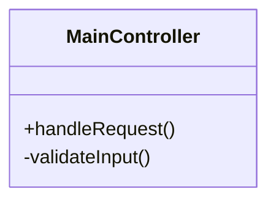

# 09. Программирование и работа с кодом в Obsidian

## Лучшие практики для разработчиков

1. **Вставка и подсветка кода**
```python
def hello_world():
    print("Hello from Obsidian!")
```

2. **Плагины для разработчиков**
   - CodeMirror - продвинутое редактирование кода
   - Snippets - хранилище часто используемого кода
   - Git - интеграция с системой контроля версий

3. **Организация технических заметок**
   - Отдельные папки для разных языков
   - Чеклисты Code Review
   - Шаблоны для документации API

4. **Пример технической документации**
````markdown

````

5. **Интеграция с IDE**
   - Синхронизация через Syncthing
   - Плагин для VS Code
   - Экспорт в HTML для документации

*Советы собраны из разделов Developers API и Plugins forum.obsidian.md*