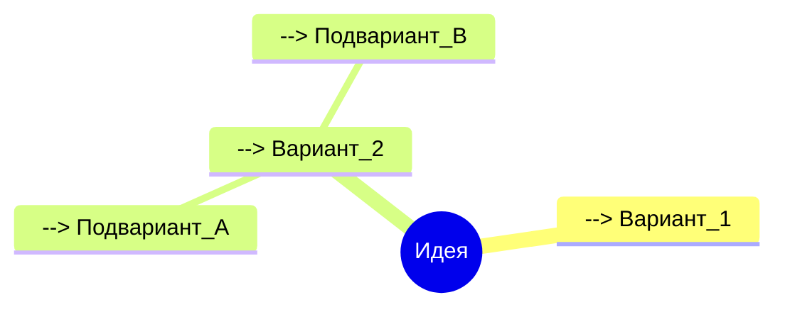

# 18. Карты знаний и визуальное мышление в Obsidian

## Методы визуальной организации идей

1. **Создание карт связей**


2. **Плагины для визуализации**
   - Excalidraw - цифровые рукописные карты
   - Mind Map - автоматическая визуализация связей
   - Juggl - интерактивные графы знаний

3. **Техники визуального мышления**
   - Цветовое кодирование тегов
   - Иконки для категорий (эмодзи)
   - Пространственное расположение заметок

4. **Пример комплексной карты**
```markdown
```canvas
{
  "nodes": [
    {
      "id": "1",
      "x": 100,
      "y": 100,
      "width": 200,
      "height": 100,
      "type": "file",
      "file": "Основная идея.md"
    }
  ],
  "edges": []
}
```

5. **Оптимизация производительности**
   - Локализация сложных графов
   - Использование уровней детализации
   - Автоматическое обновление связей

*Советы собраны из разделов Visual Thinking и Knowledge Management forum.obsidian.md*