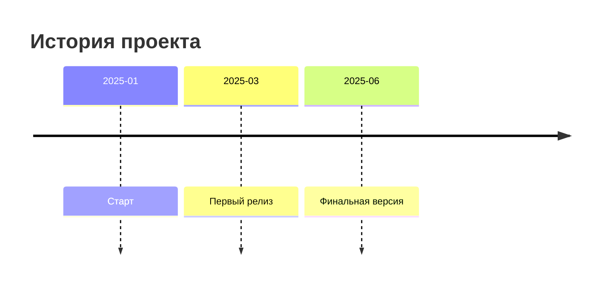

# 20. Временные шкалы и хронологии в Obsidian

## Визуализация временных данных и событий

1. **Синтаксис временных меток**
```markdown
- [ ] 2025-06-20 Завершить проект
- [x] 2025-06-18 Написать документацию
```

2. **Создание временных шкал**


3. **Плагины для работы со временем**
   - Timeline - визуализация хронологии
   - Calendar - управление событиями
   - Tasks - отслеживание дедлайнов

4. **Пример комплексной хронологии**
```dataview
TABLE WITHOUT ID
  file.link AS Событие,
  date AS Дата,
  description AS Описание
FROM "events"
SORT date ASC
```

5. **Интеграция с внешними сервисами**
   - Google Calendar через ICS
   - Notion Timeline импорт
   - Excel для сложных расчетов

*Советы собраны из разделов Data Visualization и Productivity forum.obsidian.md*