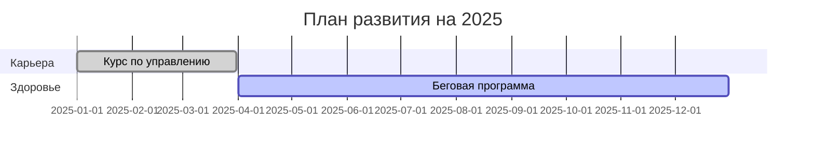

# 25. Цели и личное развитие в Obsidian

## Система постановки и отслеживания целей

1. **Структура цели**
```markdown
---
type: goal
category: здоровье
priority: high
start_date: 2025-06-01
target_date: 2025-12-31
---

# Бегать 3 раза в неделю

## План действий
- [ ] Купить новые кроссовки
- [ ] Составить график пробежек
```

2. **Методики развития**
   - OKR для целей
   - SMART-критерии
   - Еженедельные рефлексии

3. **Визуализация прогресса**


4. **Плагины для саморазвития**
   - Goals - трекинг целей
   - Habit Tracker - отслеживание привычек
   - Progress Charts - визуализация

5. **Советы по мотивации**
   - Разбивка на мелкие этапы
   - Система вознаграждений
   - Анализ препятствий

*Рекомендации собраны из Productivity и Personal Development обсуждений forum.obsidian.md*