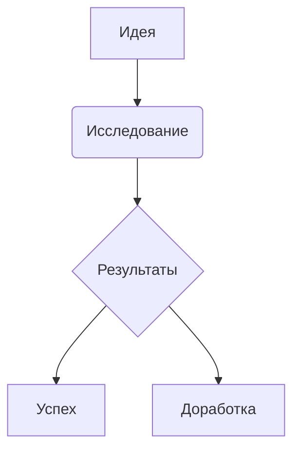

# 07. Мощная визуализация данных

## 1. Динамические графики
````markdown
```vega-lite
{
  "data": {"values": [
    {"month": "Янв", "sales": 120},
    {"month": "Фев", "sales": 180}
  ]},
  "mark": "bar",
  "encoding": {
    "x": {"field": "month", "type": "ordinal"},
    "y": {"field": "sales", "type": "quantitative"}
  }
}
```
````
- Плагин Vega/Vega-Lite
- Поддержка JSON-спецификаций
- Интерактивные элементы

## 2. Диаграммы связей
```markdown

```
- Встроенный Mermaid
- Автоматическое позиционирование
- Экспорт в PNG/SVG

## 3. Таблицы с Dataview
```markdown
```dataview
TABLE WITHOUT ID
  file.link AS "Проект",
  progress AS "Прогресс",
  bar(progress) AS "График"
FROM #project
```
```
- Функция bar() для визуализации
- Кастомные столбцы
- Динамическое обновление

## 4. Интерактивные карты
```markdown
```leaflet
lat: 55.751244
lon: 37.618423
layer: OpenStreetMap
marker: "Москва, офис"
```
```
- Плагин Leaflet
- Кастомные маркеры
- Поддержка разных слоев карт

## 5. Временные линии
```markdown
```timeline
title: История проекта
section: Этапы
2023-01-15: Старт проекта
2023-03-22: Первый релиз
```
```
- Плагин Timeline
- Группировка событий
- Горизонтальное/вертикальное отображение

*Источники: forum.obsidian.md/t/data-visualization, примеры из сообщества*

## Связанные руководства
[[00_Оглавление]] | [[07_Визуализация_данных]]
