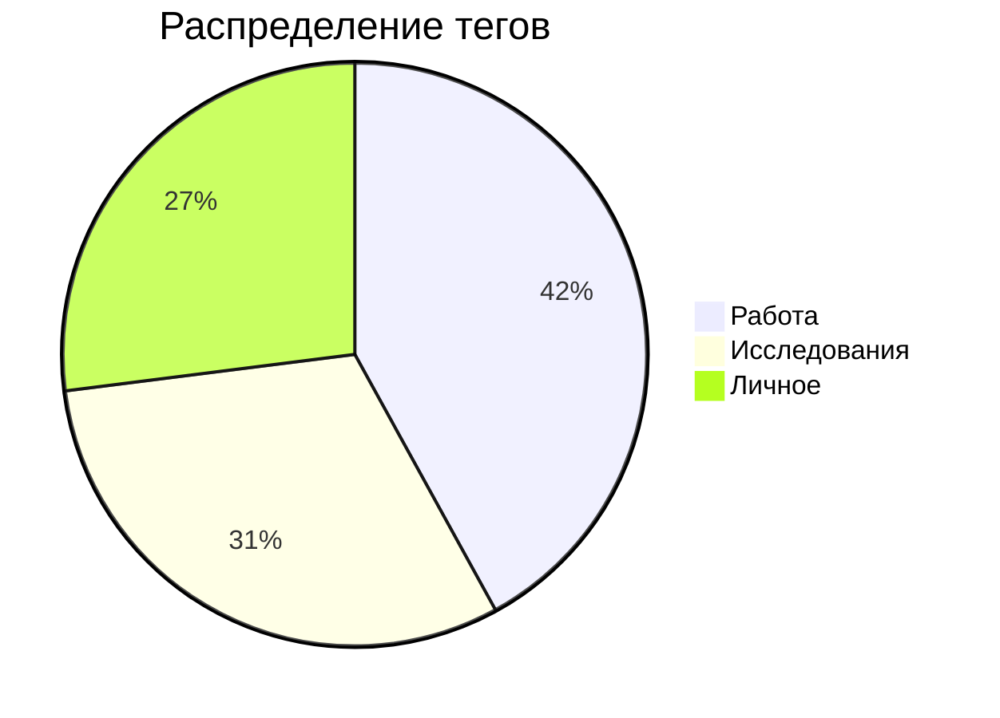

# 27. Продвинутые техники работы с тегами

## 1. Иерархия тегов
```markdown
#система/теги 
- #система/теги/приоритет/высокий
- #система/теги/приоритет/средний
- #система/теги/тип/задача
- #система/теги/тип/ссылка
```

## 2. Динамические теги
```javascript
// Автоматическое добавление тегов по контенту
app.workspace.on('file-open', (file) => {
  if (file.content.includes('TODO')) {
    app.fileManager.addTag('#задача', file);
  }
});
```

## 3. Поиск по комбинациям тегов
```markdown
```search-query
tag:#проект AND tag:#срочно -tag:#завершено
```
```

## 4. Визуализация тегов


## 5. Плагины для работы с тегами
- **Tag Wrangler**: Управление иерархией
- **TagFolder**: Визуализация в виде папок
- **Better Tags**: Автодополнение и анализ

*Источник: Официальная документация Tags 3.1+*