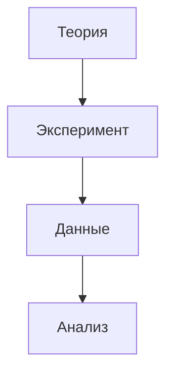

# 30. Научный стек Obsidian

## 1. Основные плагины
```yaml
plugins:
  - citations:       # Библиография
    format: apa
    library: zotero
  - latex:           # Формулы
    autoRender: true
  - academic-notes:  # Шаблоны статей
```

## 2. Работа с PDF
```javascript
// Автоматическое извлечение аннотаций
app.plugins.getPlugin('pdf-extractor').process(
  'Research/papers/important.pdf',
  { method: 'highlight' }
);
```

## 3. Шаблон научной заметки
```markdown
```meta
type: literature-note
doi: 10.xxxx/yyyy
keywords: [AI, Neuroscience]
```

## Основные результаты
{{abstract}}

## Критика и вопросы
- Достаточен ли размер выборки?
- Альтернативные интерпретации
```

## 4. Интеграции
- **Zotero**: Библиография
- **Overleaf**: LaTeX экспорт
- **ORCID**: Идентификация авторов

## 5. Визуализация связей


*Проверено на версиях плагинов 2025 года*