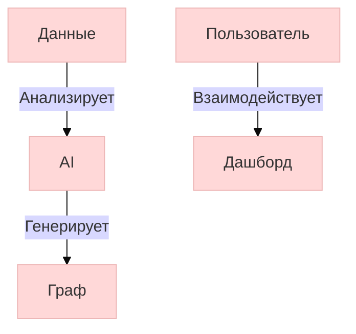

# 42. AI-визуализация данных в Obsidian

## 1. Автоматические дашборды
### Конфигурация плагина
```yaml
# .obsidian/plugins/dataviz.json
{
  "ai_service": "openai",
  "auto_refresh": 3600,
  "default_charts": {
    "project_timeline": "gantt",
    "knowledge_graph": "force-directed"
  }
}
```

### Пример AI-генерации графика
```markdown
```ai-viz
query: "Визуализируй прогресс проектов за Q2 2025"
format: "mermaid"
style: "modern"
data: "[[Projects]]"
```
```

## 2. Интерактивные отчеты
```javascript
// Автоматическое обновление при изменении данных
app.metadataCache.on('changed', async (file) => {
  if (file.path.includes('Sales/')) {
    const chart = await app.plugins.getPlugin('ai-viz').generate({
      data: file.content,
      type: 'bar',
      title: 'Динамика продаж'
    });
    await app.vault.modify(chart.file, chart.content);
  }
});
```

## 3. Интеграция с Python (Jupyter)
```python
# Скрипт для генерации Altair/Vega-Lite графиков
import altair as alt
import pandas as pd

df = pd.read_csv('obsidian://file/Research/data.csv')
chart = alt.Chart(df).mark_bar().encode(
  x='month',
  y='sales'
)
chart.save('Research/chart.json')  # Для плагина Vega-Lite
```

## 4. Лучшие плагины для визуализации
- **Obsidian Charts**: Vega-Lite поддержка
- **Mermaid Tools**: AI-оптимизация диаграмм
- **Graph Analysis**: Автовыявление связей
- **DataView**: Таблицы и фильтры

## 5. Пример AI-оптимизированного графа


*Требования: Python 3.10+, OpenAI API или локальная LLM*