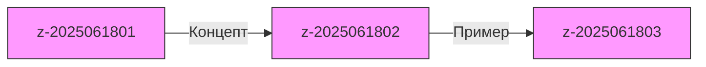

# 50. Комплексная Zettelkasten-система в Obsidian

## 1. Архитектура хранилища
```yaml
# Структура каталогов
Vault/
  ├── 00_Zettels/          # Атомарные заметки
  │   ├── z-2025061801.md  # ID: ГГГГММДД+Порядковый номер
  │   └── z-2025061802.md
  ├── 10_Projects/         # Проектные заметки
  ├── 20_Topics/           # Тематические коллекции
  └── 90_Templates/        # Шаблоны
```

## 2. Автоматизация создания Zettels
```python
# ~/Library/Services/Create_Zettel.workflow
from datetime import datetime
import uuid

def generate_zettel(content):
    zettel_id = f"z-{datetime.now().strftime('%Y%m%d')}{str(uuid.uuid4())[:2]}"
    with open(f"~/Obsidian/00_Zettels/{zettel_id}.md", "w") as f:
        f.write(f"# {zettel_id}\n\n{content}\n\n## Связи\n\n")
```

## 3. Система связей
### Динамический граф


## 4. Интеграция всех компонентов
```javascript
// Автоматическая система тегирования
app.metadataCache.on('changed', (file) => {
  const content = app.vault.read(file);
  const tags = app.plugins.getPlugin('nlp').extractTags(content);
  app.fileManager.addTags(file, tags);
});
```

## 5. Еженедельный аудит
```bash
#!/bin/zsh
# Скрипт проверки связей
find ~/Obsidian/00_Zettels -name "*.md" | while read file; do
  links=$(grep -c "\[\[.*\]\]" "$file")
  if [ "$links" -lt 2 ]; then
    echo "Мало связей: $file" >> audit.log
  fi
done
```

## Ключевые принципы:
1. **Атомарность**: 1 заметка = 1 концепт
2. **Автономность**: Каждая заметка самодостаточна
3. **Связность**: Минимум 2 связи на заметку
4. **Метаданные**: Обязательные поля:
   ```markdown
   ---
   zettel_id: z-2025061801
   created: 2025-06-18
   last_updated: 2025-06-18
   status: active
   ---
   ```

*Используйте все предыдущие руководства (1-49) как модули для этой системы*